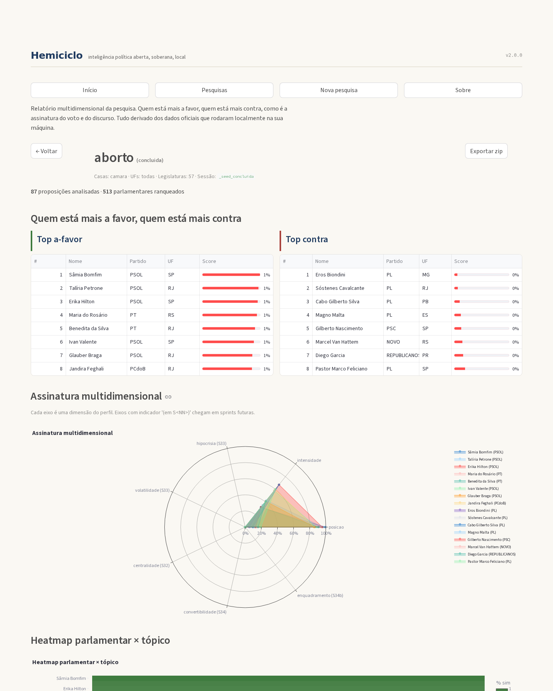

[](https://github.com/AndreBFarias/Hemiciclo/actions/workflows/ci.yml)
[](https://codecov.io/gh/AndreBFarias/Hemiciclo)
[](https://www.python.org/downloads/)
[](LICENSE)
[](#)
[](#)
[](CHANGELOG.md)
[](docs/adr/)

# Hemiciclo

> Plataforma cidadã de perfilamento parlamentar. Inteligência política aberta,
> soberana e 100% local.



## O que é

Hemiciclo é uma plataforma de inteligência política para entender o
Congresso Brasileiro com o mesmo rigor metodológico que se vende a
lobistas, mas instalável em dois comandos pelo cidadão comum. Tudo local,
sem servidor central, sem rastreio, sem custo. GPL v3.

## Início rápido

**Linux / macOS:**

```bash
git clone https://github.com/AndreBFarias/Hemiciclo.git
cd Hemiciclo
./install.sh
./run.sh
```

**Windows 10/11 (CMD ou PowerShell):**

```cmd
git clone https://github.com/AndreBFarias/Hemiciclo.git
cd Hemiciclo
install.bat
run.bat
```

O navegador abre em `http://localhost:8501` nos três sistemas. Paridade
funcional desde a sprint S36 (instalador Windows nativo, sem WSL).

Pré-requisitos: Python 3.11+, 4 GB de RAM, 5 GB em disco
(8 GB se baixar o modelo de embeddings `bge-m3`).

> Para análise semântica completa já na primeira sessão (camada C3 ativa),
> adicione `--com-modelo` ao instalador: `./install.sh --com-modelo` ou
> `install.bat --com-modelo`. Isso baixa o `BAAI/bge-m3` (~2GB extras,
> 5-15 min). Sem a flag, a camada C3 fica em skip silencioso até o
> download manual. Detalhes em [`docs/usuario/instalacao.md`](docs/usuario/instalacao.md).

## O que o Hemiciclo faz

Três casos concretos a partir dos dados públicos da Câmara e do Senado:

- **Top a favor / Top contra por tópico:** classificador multicamada
  (regex auditável + voto nominal + embeddings + LLM opcional) ranqueia
  parlamentares por posição agregada em qualquer recorte (casa, UF,
  partido, período).
- **Histórico de conversão:** detecta quando um parlamentar mudou de
  posição ao longo das legislaturas, com índice de volatilidade e
  marcação de cada mudança em pontos percentuais.
- **Rede de coautoria e voto:** grafo `pyvis` interativo embedável no
  dashboard, com detecção de comunidades (Louvain) e métricas de
  centralidade. Identifica articuladores e parlamentares-ponte.

E ainda: ranking de convertibilidade (regressão logística sobre features
de S33+S32+S27), heatmap parlamentar × tópico, assinatura multidimensional
em radar polar de até 7 eixos, exportação samizdat (zip auditável que
você manda por email/USB pra outro pesquisador).

## Limitações honestas

- **Não recomenda voto** ao eleitor. O Hemiciclo é lente, não bússola
  moral.
- **Modelo correlacional, não causal.** O eixo de convertibilidade prevê
  probabilidade com base em padrão histórico, não relação causa-efeito.
- **Cobertura de classificação por tópico** depende de YAMLs curados em
  `topicos/`. Os 3 seeds (aborto, porte de armas, marco temporal) são
  pontos de partida; PRs com novos tópicos são bem-vindos.
- **Camada 4 (LLM opcional)** está atrasada para v2.1+ (sprint S34b).
- **Histórico de conversão** depende da migration M002 da S27.1 para
  filtragem por tópico. Hoje filtra por parlamentar global.
- **Não detecta corrupção** -- só correlações comportamentais entre
  parlamentares.

## Estatísticas da release v2.0.0

- 17 sprints DONE (S22 a S38, mais infra de release)
- 477 testes verdes em CI multi-OS (Linux + macOS + Windows × Python 3.11 + 3.12)
- Cobertura ≥ 90% sobre `src/hemiciclo/`
- 20 ADRs canônicos cobrindo decisões fundadoras D1-D11 e infraestrutura
- 6 jobs CI paralelos por commit, ruff + mypy --strict + pytest
- 4 camadas de classificador (regex / voto / embeddings / LLM opcional)
- 7 eixos da assinatura multidimensional (4 já implementados em v2.0.0)

## Comandos do dev

```bash
uv run hemiciclo --version    # hemiciclo 2.0.0
uv run hemiciclo info         # Lista paths e estado do ambiente
uv run hemiciclo dashboard    # Sobe o Streamlit (equivalente a ./run.sh)
make check                    # Lint + tipos + testes + cobertura
```

## Referências

- **Plano técnico completo:** [`docs/superpowers/specs/2026-04-27-hemiciclo-2-design.md`](docs/superpowers/specs/2026-04-27-hemiciclo-2-design.md)
- **ADRs:** [`docs/adr/`](docs/adr/) (ADR-001 a ADR-020)
- **Manifesto político:** [`docs/manifesto.md`](docs/manifesto.md)
- **Roadmap de sprints:** [`sprints/ORDEM.md`](sprints/ORDEM.md)
- **Invariantes do projeto:** [`VALIDATOR_BRIEF.md`](VALIDATOR_BRIEF.md)
- **Guia de instalação:** [`docs/usuario/instalacao.md`](docs/usuario/instalacao.md)
- **Primeira pesquisa:** [`docs/usuario/primeira_pesquisa.md`](docs/usuario/primeira_pesquisa.md)
- **Interpretando o relatório:** [`docs/usuario/interpretando_relatorio.md`](docs/usuario/interpretando_relatorio.md)
- **Versão R original** preservada em [`legacy-r`](https://github.com/AndreBFarias/Hemiciclo/tree/legacy-r) para auditoria histórica.

## Como contribuir

Veja [`CONTRIBUTING.md`](CONTRIBUTING.md) e [`CODE_OF_CONDUCT.md`](CODE_OF_CONDUCT.md).
PRs seguem Conventional Commits (ADR-017) e devem passar em todos os 6
jobs CI. Para sugerir tópico novo do classificador, use o template
`.github/ISSUE_TEMPLATE/topico.md`.

## Segurança

Vulnerabilidades: veja [`SECURITY.md`](SECURITY.md).

## Licença

GPL v3 -- livre para usar, modificar e redistribuir, desde que versões
derivadas mantenham a mesma licença. Ver [`LICENSE`](LICENSE).

---

*"A palavra pública é o solo onde a liberdade se enraíza."* -- Hannah Arendt
